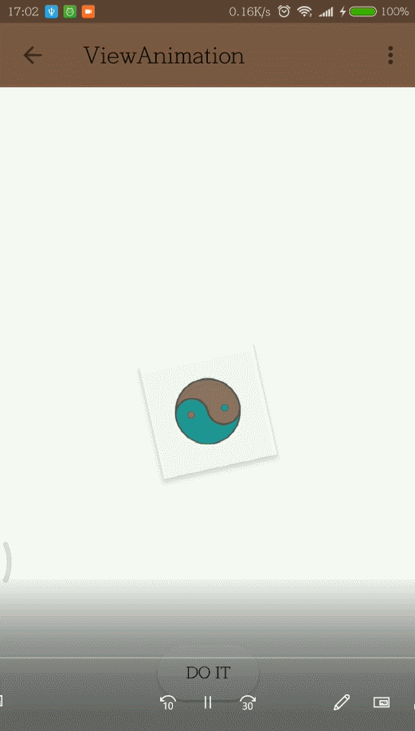
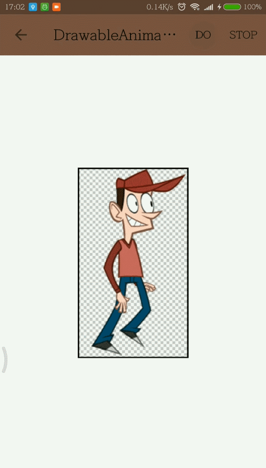
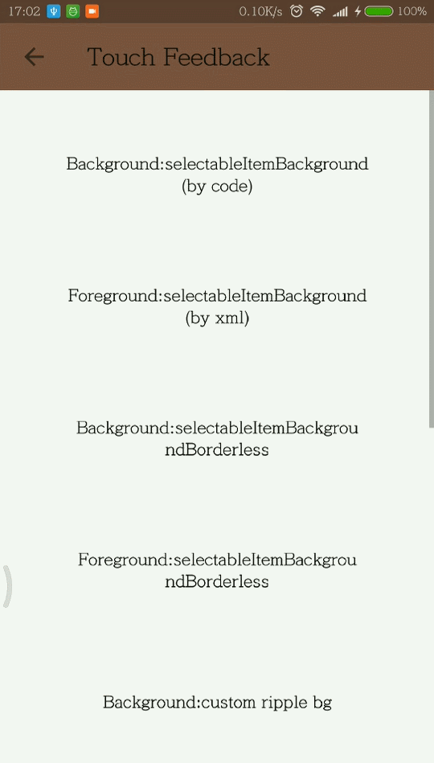
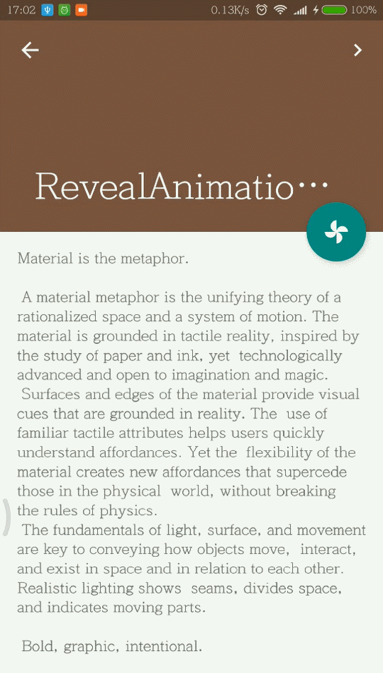
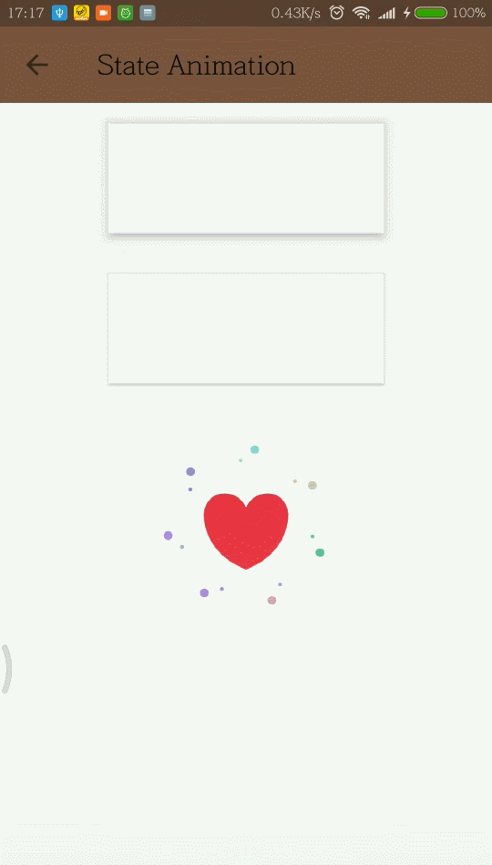
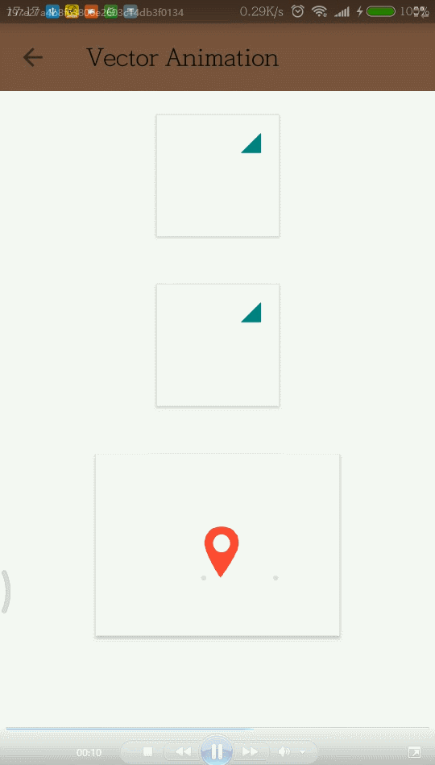

# Android Animation Detailed Tutorial / Android 动画详尽教程

&ensp;&ensp;
&ensp;&ensp;
  

 

* **中文讲解（README）请直接点击对应标题**  
* **English explanation(or readme), Do not click on the title, please click on the tip address**

**文章开篇总结性文章：**[《Android 一共有多少种动画？准确告诉你！》](./AndroidAnimationTips.md)  

## Ⅰ. [View Animation / 视图动画](https://github.com/OCNYang/Android-Animation-Set/tree/master/view-animation)

[English explanation can go to read this article](https://developer.android.com/guide/topics/graphics/view-animation.html)  

## Ⅱ. [Drawable Animation / 帧动画 / Frame 动画](https://github.com/OCNYang/Android-Animation-Set/tree/master/drawable-animation)

[English explanation can go to read this article](https://developer.android.com/reference/android/graphics/drawable/AnimationDrawable.html)  

## Ⅲ. [Property Animation / 属性动画](https://github.com/OCNYang/Android-Animation-Set/tree/master/property-animation)  

[English explanation can go to read this article](https://developer.android.com/guide/topics/graphics/prop-animation.html)  

## Ⅳ. [Ripple Effect / Touch Feedback / 触摸反馈动画](https://github.com/OCNYang/Android-Animation-Set/tree/master/ripple-animation)

[English explanation can go to read this article](https://guides.codepath.com/android/Ripple-Animation)  

## Ⅴ. [Reveal Effect / 揭露动画](https://github.com/OCNYang/Android-Animation-Set/tree/master/reveal-animation)

[English explanation can go to read this article](http://anjithsasindran.in/blog/2015/08/15/material-sharing-card/)  

## Ⅵ. [Transition Animation / 转场动画 & 共享元素](https://github.com/OCNYang/Android-Animation-Set/tree/master/transition-animation)

[English explanation can go to read this readme](https://github.com/OCNYang/Android-Animation-Set/blob/master/transition-animation/README_EN.md)  

## Ⅶ. [Animate View State Changes / 视图状态动画](https://github.com/OCNYang/Android-Animation-Set/tree/master/state-animation)

[English explanation can go to read ](https://developer.android.com/training/material/animations.html)
[**StateListAnimator**](https://developer.android.com/reference/android/animation/StateListAnimator.html) and [**StateListDrawable**](https://developer.android.com/reference/android/graphics/drawable/StateListDrawable.html)

## Ⅷ. [AnimatedVectorDrawable / 矢量图动画](https://github.com/OCNYang/Android-Animation-Set/tree/master/vector-animation)

[English explanation can go to read this article](https://www.androiddesignpatterns.com/2016/11/introduction-to-icon-animation-techniques.html) 
or [AnimatedVectorDrawable](https://developer.android.com/reference/android/graphics/drawable/AnimatedVectorDrawable.html) 
or [VectorDrawable](https://developer.android.com/reference/android/graphics/drawable/VectorDrawable.html)

## Ⅸ. [Constraint Animation / ConstraintSet / 约束布局关键帧动画](https://github.com/OCNYang/Android-Animation-Set/tree/master/constraint-animation)

[English explanation can go to read this article](http://www.uwanttolearn.com/android/constraint-layout-animations-dynamic-constraints-ui-java-hell/) 

## [Wiki 附属文章](https://github.com/OCNYang/Android-Animation-Set/wiki)

* [View 动画几种特殊使用场景](https://github.com/OCNYang/Android-Animation-Set/wiki/View-%E5%8A%A8%E7%94%BB%E5%87%A0%E7%A7%8D%E7%89%B9%E6%AE%8A%E4%BD%BF%E7%94%A8%E5%9C%BA%E6%99%AF)  
* [实现 Activity 的切换动画](https://github.com/OCNYang/Android-Animation-Set/wiki/%E5%AE%9E%E7%8E%B0-Activity-%E7%9A%84%E5%88%87%E6%8D%A2%E5%8A%A8%E7%94%BB)  
* [SVG 讲解](https://github.com/OCNYang/Android-Animation-Set/wiki/SVG-%E8%AE%B2%E8%A7%A3)  
* [属性动画之 ViewPropertyAnimator 原理解析](https://github.com/OCNYang/Android-Animation-Set/wiki/%E5%B1%9E%E6%80%A7%E5%8A%A8%E7%94%BB%E4%B9%8B-ViewPropertyAnimator-%E5%8E%9F%E7%90%86%E8%A7%A3%E6%9E%90)  
* [深入理解 Content Transition](https://github.com/OCNYang/Android-Animation-Set/wiki/%E6%B7%B1%E5%85%A5%E7%90%86%E8%A7%A3-Content-Transition)  

## 遗漏提交  

由于个人能力局限，难免会有遗漏的动画，大家如果发现有遗漏的动画、或者发现问题，可以[提交 Issues ](https://github.com/OCNYang/Android-Animation-Set/issues/new)（请注明“遗漏提交”，也可以附上推荐的对应讲解教程地址），我会逐渐完善这个系列教程。

## Demo  

   

   

   

   

<!--  
  
  
  
  
  
  
-->

Download [**Demo Apk**](https://github.com/OCNYang/Android-Animation-Set/raw/master/README_Res/app-debug.apk)  
or scan code to download（扫码下载）  

*更全面的讲解将会逐步补充 / 欢迎 Star / 欢迎 Fork*

  
  
 
&ensp;&ensp;

